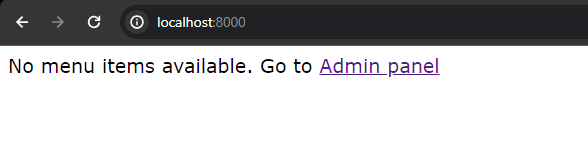
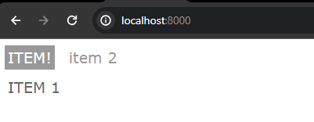
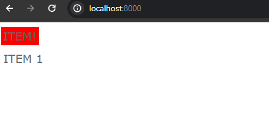

# Test backend (UpTrader)

## Overview

Задача :
Нужно сделать django app, который будет реализовывать древовидное меню, соблюдая следующие условия:

1. Меню реализовано через template tag
2. Все, что над выделенным пунктом - развернуто. Первый уровень вложенности под выделенным пунктом тоже развернут.
3. Хранится в БД.
4. Редактируется в стандартной админке Django
5. Активный пункт меню определяется исходя из URL текущей страницы
6. Меню на одной странице может быть несколько. Они определяются по названию.
7. При клике на меню происходит переход по заданному в нем URL. URL может быть задан как явным образом, так и через named url.
8. На отрисовку каждого меню требуется ровно 1 запрос к БД
   Нужен django-app, который позволяет вносить в БД меню (одно или несколько) через админку, и нарисовать на любой нужной странице меню по названию.
   
   При выполнении задания из библиотек следует использовать только Django и стандартную библиотеку Python.

## Prerequisites

Make sure you have the Python installed:

- Python (version 3.x recommended)

## Note:

In the command line, type `python`. If Python is installed, you should see a message like “Python 3.x.x” followed by the Python prompt, which looks like this “>>>”. Note that “3.x.x” represents the version number of Python

```bash
python
# OR
python --version
```

# Demo:

## Empty menu-bar



## No active links



## Active links



**1.Clone the Repo**

```sh
git clone https://github.com/Kaiyrtay/UpTrader-backed-test-assignment.git
```

**2.Install Requirements**

```sh
pip install -r requirements.txt
```

**3.Create .env**

```sh
touch .env
```

At your .env file:

```bash
DEBUG=True/False
SECRET_KEY=<your_value>
```

**4.Apply migrations:**

```bash
python manage.py migrate
```

**5.Create a superuser (admin):**

```bash
python manage.py createsuperuser
```

**6.Collect static files:**

```bash
python manage.py collectstatic
```

**7.Start the development server:**

```bash
python manage.py runserver
```

# End

Have a nice day!!!
